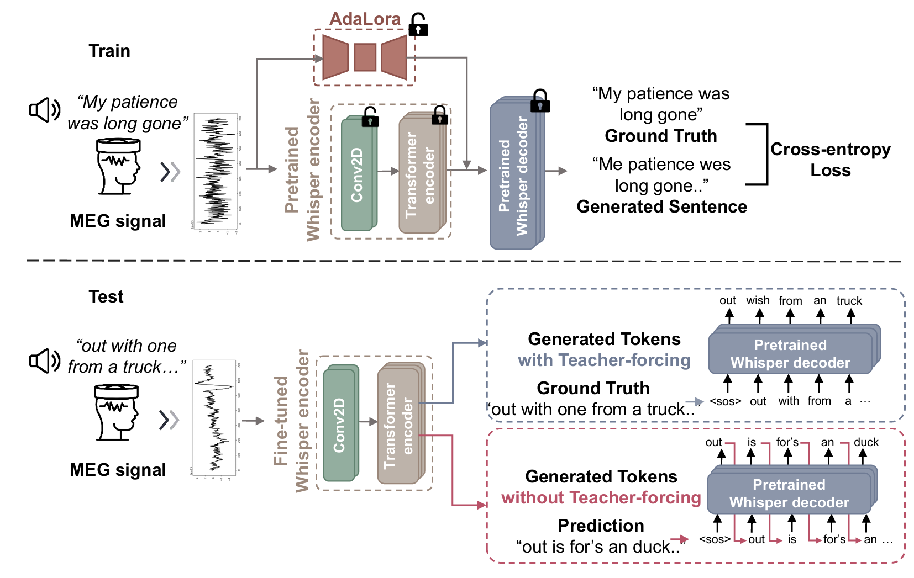

# NeuSpeech: Decode Neural signal as Speech
paper at https://arxiv.org/abs/2403.01748



how to run the code?

you need to change file path in the python files before you run the cmd.

1. preprocess data 
```shell
python process_dataset/gwilliams2023_process.py
python process_dataset/schoffelen_process.py
python process_dataset/filter_schoffelen_jsonl.py  # only used sentence data in our experiments
```

2. run the training and evaluation

train the gwilliams dataset
```shell
# train the model on Gwilliams dataset
python finetune.py --per_device_train_batch_size=64\
 --per_device_eval_batch_size=64 --output_dir='output_models/27-gwilliams2023-split1-no_aug'\
  --eval_steps=1000 --save_steps=1000\
  --learning_rate=1e-3 --fp16=True\
 --num_train_epochs=500 --warmup_steps=500 --max_audio_len=30\
 --use_8bit=False --num_workers=16 --modal='eeg' --eeg_ch=208 --sampling_rate=200 --orig_sample_rate=200\
 --train_data='/hpc2hdd/home/yyang937/datasets/gwilliams2023/preprocess5/split1/train.jsonl'\
 --test_data='/hpc2hdd/home/yyang937/datasets/gwilliams2023/preprocess5/split1/val.jsonl'\
 --base_model='openai/whisper-base' --augment_config_path='configs/augmentation1.json'\
 --local_files_only=False --language='English' --device='cuda'


# evaluate the model on Gwilliams dataset
python evaluation.py\
 --model_path='openai/whisper-base'\
 --lora_model="output_models/27-gwilliams2023-split1-no_aug/whisper-base/checkpoint-54000"\
 --test_data='/hpc2hdd/home/yyang937/datasets/gwilliams2023/preprocess5/split1/test.jsonl'\
 --modal='eeg' --sampling_rate=200 --eeg_ch=208 --batch_size=4 --num_workers=4 --language='English'\
 --timestamps=False --local_files_only=False
```

train the schoffelen dataset
```shell
# train the model on Schoffelen dataset
python finetune.py --per_device_train_batch_size=64\
 --per_device_eval_batch_size=64 --output_dir='output_models/28-schoffelen'\
 --eval_steps=1000 --save_steps=1000 --learning_rate=1e-3 --fp16=True\
 --num_train_epochs=500 --warmup_steps=500 --max_audio_len=30\
 --use_8bit=False --num_workers=16 --modal='eeg' --eeg_ch=273 --sampling_rate=200 --orig_sample_rate=200\
 --train_data='/hpc2hdd/home/yyang937/datasets/schoffelen2019n/preprocess6/ZINNEN/train.jsonl'\
 --test_data='/hpc2hdd/home/yyang937/datasets/schoffelen2019n/preprocess6/ZINNEN/val.jsonl'\
 --base_model='openai/whisper-base' --augment_config_path='configs/augmentation1.json'\
 --local_files_only=False --language='Dutch' --device='cuda'


# evaluate the model on Schoffelen dataset
python evaluation.py\
 --model_path='openai/whisper-base'\
 --lora_model="output_models/28-schoffelen/whisper-base/checkpoint-14000"\
 --test_data='/hpc2hdd/home/yyang937/datasets/schoffelen2019n/preprocess6/ZINNEN/test.jsonl'\
 --modal='eeg' --sampling_rate=200 --eeg_ch=273 --batch_size=128 --num_workers=16 --language='Dutch'\
 --timestamps=False --local_files_only=False --filter_dataset=True
```

the pretraining used trained models above.

following is the pretraining on schoffelen dataset

```shell
# pretraining on schoffelen, train on gwilliams
python finetune.py --per_device_train_batch_size=64\
 --per_device_eval_batch_size=64 --output_dir='output_models/31-gwilliams2023-split1-no_aug-pretrain28'\
  --eval_steps=1000 --save_steps=1000\
  --learning_rate=1e-3 --fp16=True\
 --num_train_epochs=500 --warmup_steps=500 --max_audio_len=30\
 --use_8bit=False --num_workers=16 --modal='eeg' --eeg_ch=208 --sampling_rate=200 --orig_sample_rate=200\
 --train_data='/hpc2hdd/home/yyang937/datasets/gwilliams2023/preprocess5/split1/train.jsonl'\
 --test_data='/hpc2hdd/home/yyang937/datasets/gwilliams2023/preprocess5/split1/val.jsonl'\
 --base_model='openai/whisper-base' --augment_config_path='configs/augmentation1.json'\
 --local_files_only=False --language='English' --device='cuda'\
 --lora_model='output_models/28-schoffelen/whisper-base/checkpoint-14000'\
 --lora_eeg_ch=273
 
python merge_lora.py \
--lora_model='/hpc2hdd/home/yyang937/brain2text/whisper/output_models/28-schoffelen/whisper-base/checkpoint-14000'\
 --model_path='openai/whisper-base' --eeg_ch=273
 
python evaluation.py\
 --model_path='/hpc2hdd/home/yyang937/brain2text/whisper/output_models/28-schoffelen/whisper-base/checkpoint-14000/full_model'\
 --lora_model="output_models/31-gwilliams2023-split1-no_aug-pretrain28/whisper-base/checkpoint-44000"\
 --test_data='/hpc2hdd/home/yyang937/datasets/gwilliams2023/preprocess5/split1/test.jsonl'\
 --modal='eeg' --sampling_rate=200 --eeg_ch=208 --batch_size=128 --num_workers=16 --language='English'\
 --timestamps=False --local_files_only=False
```

following is the pretraining on gwilliams dataset

```shell
# pretraining on gwilliams, train on schoffelen

python finetune.py --per_device_train_batch_size=64\
 --per_device_eval_batch_size=64 --output_dir='output_models/30-schoffelen-pretrain27'\
 --eval_steps=1000 --save_steps=1000 --learning_rate=1e-3 --fp16=True\
 --num_train_epochs=500 --warmup_steps=500 --max_audio_len=30\
 --use_8bit=False --num_workers=16 --modal='eeg' --eeg_ch=273 --sampling_rate=200 --orig_sample_rate=200\
 --train_data='/hpc2hdd/home/yyang937/datasets/schoffelen2019n/preprocess6/ZINNEN/train.jsonl'\
 --test_data='/hpc2hdd/home/yyang937/datasets/schoffelen2019n/preprocess6/ZINNEN/val.jsonl'\
 --base_model='openai/whisper-base' --augment_config_path='configs/augmentation1.json'\
 --local_files_only=False --language='Dutch' --device='cuda'\
 --lora_model='output_models/27-gwilliams2023-split1-no_aug/whisper-base/checkpoint-54000'\
 --lora_eeg_ch=208

python merge_lora.py \
--lora_model='/hpc2hdd/home/yyang937/brain2text/whisper/output_models/27-gwilliams2023-split1-no_aug/whisper-base/checkpoint-54000'\
 --model_path='openai/whisper-base' --eeg_ch=208
 
python evaluation.py\
 --model_path='/hpc2hdd/home/yyang937/brain2text/whisper/output_models/27-gwilliams2023-split1-no_aug/whisper-base/checkpoint-54000/full_model'\
 --lora_model="/hpc2hdd/home/yyang937/brain2text/whisper/output_models/30-schoffelen-pretrain27/whisper-base/checkpoint-12000"\
 --test_data='/hpc2hdd/home/yyang937/datasets/schoffelen2019n/preprocess6/ZINNEN/test.jsonl'\
 --modal='eeg' --sampling_rate=200 --eeg_ch=273 --batch_size=128 --num_workers=16 --language='Dutch'\
 --timestamps=False --local_files_only=True
```

following is training two datasets together

```shell
python process_dataset/combine_jsonls.py --jsonl \
"datasets/schoffelen2019n/preprocess6/ZINNEN/train.jsonl"\
 "datasets/gwilliams2023/preprocess5/split1/train.jsonl" \
--output_jsonl="datasets/gwilliams_schoffelen/train.jsonl"

python process_dataset/combine_jsonls.py --jsonl \
"datasets/schoffelen2019n/preprocess6/ZINNEN/val.jsonl"\
 "datasets/gwilliams2023/preprocess5/split1/val.jsonl" \
--output_jsonl="datasets/gwilliams_schoffelen/val.jsonl"

python process_dataset/combine_jsonls.py --jsonl \
"datasets/schoffelen2019n/preprocess6/ZINNEN/test.jsonl"\
 "datasets/gwilliams2023/preprocess5/split1/test.jsonl" \
--output_jsonl="datasets/gwilliams_schoffelen/test.jsonl"

python finetune.py --per_device_train_batch_size=64\
 --per_device_eval_batch_size=64 --output_dir='output_models/32-combine-no_aug'\
  --eval_steps=1000 --save_steps=1000\
  --learning_rate=1e-3 --fp16=True\
 --num_train_epochs=500 --warmup_steps=500 --max_audio_len=30\
 --use_8bit=False --num_workers=16 --modal='eeg' --eeg_ch=273 --sampling_rate=200 --orig_sample_rate=200\
 --train_data='/hpc2hdd/home/yyang937/datasets/gwilliams_schoffelen/train.jsonl'\
 --test_data='/hpc2hdd/home/yyang937/datasets/gwilliams_schoffelen/val.jsonl'\
 --base_model='openai/whisper-base' --augment_config_path='configs/augmentation1.json'\
 --local_files_only=False --language=None --device='cuda'
 
python evaluation.py\
 --model_path='openai/whisper-base'\
 --lora_model="/hpc2hdd/home/yyang937/brain2text/whisper/output_models/32-combine-no_aug/whisper-base/checkpoint-87000"\
 --test_data='/hpc2hdd/home/yyang937/datasets/schoffelen2019n/preprocess6/ZINNEN/test.jsonl'\
 --modal='eeg' --sampling_rate=200 --eeg_ch=273 --batch_size=128 --num_workers=16 --language='Dutch'\
 --timestamps=False --local_files_only=True --extra_name="schoffelen"

python evaluation.py\
 --model_path='openai/whisper-base'\
 --lora_model="/hpc2hdd/home/yyang937/brain2text/whisper/output_models/32-combine-no_aug/whisper-base/checkpoint-87000"\
 --test_data='/hpc2hdd/home/yyang937/datasets/gwilliams2023/preprocess5/split1/test.jsonl'\
 --modal='eeg' --sampling_rate=200 --eeg_ch=273 --batch_size=128 --num_workers=16 --language='English'\
 --timestamps=False --local_files_only=True --extra_name="gwilliams"

```

Thanks for raising issues, please feel free to raise issues if you encounter any problem.

Thanks yeyupiaoling for finetuning whisper pipeline https://github.com/yeyupiaoling/Whisper-Finetune
